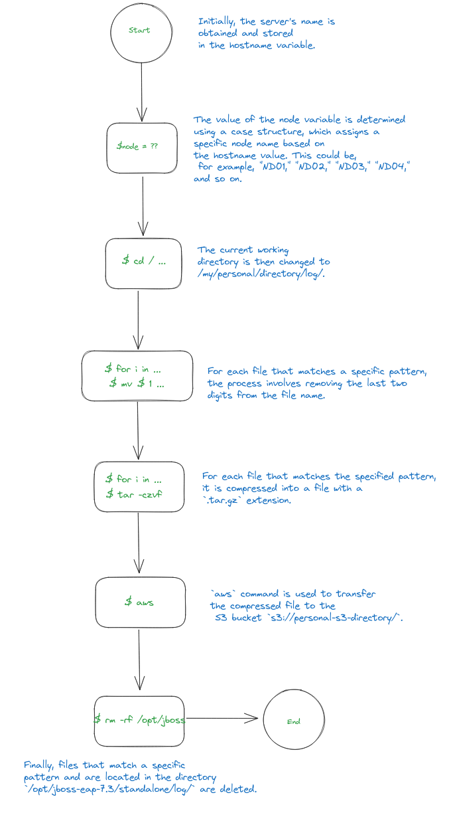
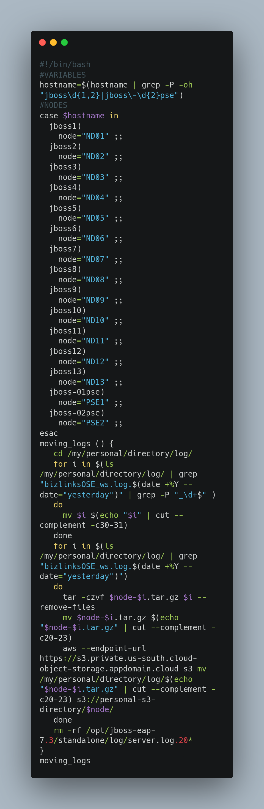

# **COMPRESSION S3** 

    

        
    

    

        

            En esta rama de <strong><code>GitHub</code></strong>, se encuentra un script de shell diseñado para
            simplificar y automatizar la gestión de registros de logs en un entorno de servidor
            <strong><code>JBoss</code></strong>. El script realiza una serie de tareas esenciales de manera organizada y
            eficiente. A continuación, se describe el flujo de trabajo del script en pasos detallados:
        

        <ul>
            <li>
                <strong>Obtención del Nombre del Servidor:</strong> 
                El script comienza recuperando el nombre del servidor en el que se ejecuta mediante el comando
                <strong><code>hostname</strong></code>. Luego, utiliza <strong><code>grep</strong></code> con
                        expresiones regulares para extraer un nombre específico, como
                        <strong><code>jbossX</strong></code> o <strong><code>jboss-XXpse</strong></code>, que se
                                encuentra codificado en el script. El resultado se almacena en la variable
                                <strong><code>hostname</strong></code>.
            </li>
            <li>
                <strong>Asignación de la Variable <code>node</code>:</strong> 
                A continuación, el script utiliza una estructura <strong><code>case</strong></code> para asignar un
                    valor a la variable <code>node</code> en función del valor de <code>hostname</code>. Dependiendo de
                    <code>hostname</code>, se asigna un nombre de nodo específico a la variable <code>node</code>, como
                    <code>ND01</code>, <code>ND02</code>, <code>PSE1</code>, etc.
            </li>
            <li>
                <strong>Función <code>moving_logs</code>:</strong> La función <code>moving_logs</code> se encarga de
                las siguientes acciones:
                <ul>
                    <li>
                        <strong>a. Cambio de Directorio de Trabajo:</strong> Cambia el directorio de trabajo actual a
                        <strong><code>/my/personal/directory/log/</strong></code>.
                    </li>
                    <li>
                        <strong>b. Iteración y Cambio de Nombre de Archivos:</strong> Itera a través de los archivos en
                        ese directorio que cumplen ciertas condiciones. Busca archivos con nombres que coincidan con el
                        patrón <strong><code>bizlinksOSE_ws.log.AÑO --date="yesterday")_NUMERO</strong></code>. Luego,
                            extrae el número final del nombre del archivo y realiza un cambio de nombre, eliminando los
                            dos últimos dígitos de ese número.
                    </li>
                    <li>
                        <strong>c. Compresión de Archivos y Cambio de Nombre</strong>: Itera nuevamente a través de los
                        mismos archivos que coinciden con el patrón
                        <strong><code>bizlinksOSE_ws.log.AÑO --date="yesterday")"</strong></code>. Comprime cada archivo
                            en un archivo <strong><code>.tar.gz</strong></code> con un nombre que incluye el valor de
                                node. Luego, realiza un cambio de nombre en el archivo .tar.gz, eliminando una parte de
                                su nombre.
                    </li>
                    <li>
                        <strong>Obtención del Nombre del Servidor:</strong> 
                        Se utiliza el comando <strong><code>aws</strong></code> para mover los archivos
                            <strong><code>.tar.gz</strong></code> al bucket S3
                                <strong><code>s3://personal-s3-directory/$node/</strong></code>.
                    </li>
                </ul>
            </li>
        </ul>
    

